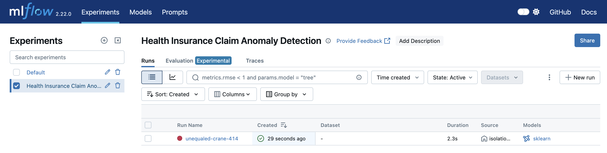
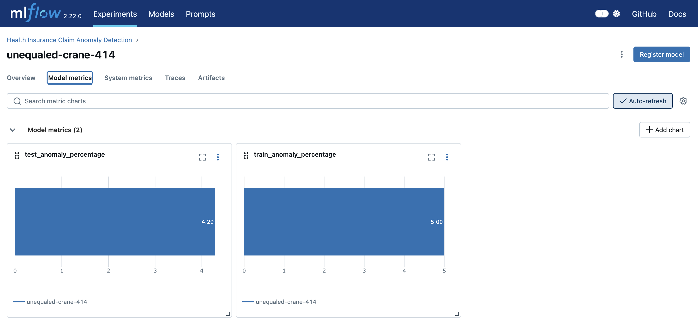

# Health Insurance Claim Fraud Detection System

This repository contains a machine learning-based system for detecting anomalous health insurance claims using Isolation Forest algorithm. The system is designed to help insurance companies identify potentially fraudulent claims by analyzing various features of the claims data.

## System Overview

The system implements an end-to-end machine learning pipeline for insurance claim processing:

1. **User Interface**: Insurance agents submit claims through a web portal
2. **Automated Analysis**: The ML model processes claims and flags suspicious cases
3. **Decision Support**: Results guide agents to either:
   - Approve claims for immediate payout
   - Flag claims for further investigation
4. **Continuous Learning**: The model is regularly retrained using new data from a data lake (e.g., AWS S3)

### System Architecture and Workflow


#### Step 1: Model Training and Registration
The trained model is registered in MLflow for version control and tracking:




#### Step 2: API Service Deployment
BentoML creates a REST API service for model access:


#### Step 3: Web Interface
Users can submit claims through an intuitive web interface:


#### Step 4: Results and Decision Support
The model provides clear predictions:
- Score of 1: Claim is approved for processing
- Score of -1: Claim requires further investigation


This automated system significantly improves efficiency by:
- Reducing manual review time for straightforward claims
- Prioritizing suspicious claims for detailed investigation
- Providing consistent and objective claim assessment
- Enabling faster processing of legitimate claims

## Project Structure

```
├── model.pkl                    # Trained Isolation Forest model
├── requirements.txt            # Python dependencies
├── synthetic_health_claims.csv # Sample dataset for training
├── isolation_model.py         # Model training script
├── service.py                 # BentoML service definition
├── register_model.py          # Model registration script
├── v2_app.py                  # Flask web application
├── test_claim.py              # Test script for claim prediction
├── templates/                 # HTML templates for web interface
└── mlartifacts/              # MLflow artifacts
```

## File Descriptions

### Core Model Files
- `isolation_model.py`: The main model training script that:
  - Implements the Isolation Forest algorithm for anomaly detection
  - Handles data preprocessing and feature engineering
  - Integrates with MLflow for experiment tracking
  - Saves model artifacts and metrics
  - Configures model hyperparameters (n_estimators=100, contamination=0.05)

- `model.pkl`: The serialized trained model file containing:
  - Trained Isolation Forest model parameters
  - Model configuration and hyperparameters
  - Feature scaling information

### Service and API Files
- `service.py`: BentoML service definition that:
  - Loads the trained model
  - Defines the prediction API endpoint
  - Handles input validation and preprocessing
  - Returns anomaly predictions (-1 for anomaly, 1 for normal)

- `register_model.py`: Model registration script that:
  - Registers the trained model with MLflow
  - Creates model versioning
  - Sets up model metadata and tags

### Web Application Files
- `v2_app.py`: The main Flask web application that:
  - Provides a user-friendly web interface
  - Handles file uploads and data processing
  - Communicates with the BentoML service to communicate with ML model via API
  - Generates visualizations of predictions
  - Manages user sessions and data persistence

- `templates/`: Directory containing HTML templates:
  - `index.html`: Main upload interface
  - `result.html`: Prediction results display
  - `visualize.html`: Data visualization interface

### Testing and Data Files
- `test_claim.py`: Test script for:
  - Validating model predictions
  - Testing API endpoints
  - Ensuring data preprocessing consistency
  - Running sample predictions

- `synthetic_health_claims.csv`: Sample dataset containing:
  - Synthetic health insurance claims data
  - Features used for training and prediction
  - Balanced distribution of normal and anomalous claims

### Configuration and Dependencies
- `requirements.txt`: Lists all Python dependencies:
  - mlflow: For experiment tracking and model versioning
  - pandas: For data manipulation
  - numpy: For numerical computations
  - bentoml: For model serving and API deployment

- `mlartifacts/`: Directory containing:
  - MLflow experiment tracking data
  - Model versioning information
  - Training metrics and parameters
  - Model performance logs

## Features

- Anomaly detection using Isolation Forest algorithm
- Model versioning and tracking with MLflow
- REST API service using BentoML
- Web interface for claim submission and visualization
- Real-time prediction and visualization of results

## Prerequisites

- Python 3.7+
- pip (Python package manager)

## Installation

1. Clone the repository:
```bash
git clone <repository-url>
cd mlops-fraud-detection-project
```

2. Create and activate a virtual environment:
```bash
python -m venv venv
source venv/bin/activate  # On Windows: venv\Scripts\activate
```

3. Install dependencies:
```bash
pip install -r requirements.txt
```

## Usage

### 1. Training the Model

The model is trained using the `isolation_model.py` script, which:
- Loads synthetic health claims data
- Trains an Isolation Forest model
- Logs model parameters and metrics using MLflow
- Saves the trained model

To train the model:
```bash
python isolation_model.py
```

### 2. Starting the BentoML Service

The BentoML service provides a REST API for model predictions:

```bash
bentoml serve service:svc
```

### 3. Running the Web Application

The web application provides a user-friendly interface for submitting claims and viewing results:

```bash
python v2_app.py
```

The application will be available at `http://localhost:5005`

## How It Works

1. **Data Processing**:
   - The system processes health insurance claims data with features like:
     - claim_amount
     - num_services
     - patient_age
     - provider_id
     - days_since_last_claim

2. **Model Training**:
   - Uses Isolation Forest algorithm for anomaly detection
   - Automatically identifies patterns in normal claims
   - Flags claims that deviate significantly from normal patterns

3. **Prediction Pipeline**:
   - Users can submit claims through the web interface
   - Claims are processed and sent to the BentoML service
   - Model returns anomaly predictions
   - Results are displayed with visualizations

4. **Model Management**:
   - MLflow tracks model versions and performance metrics
   - Easy model deployment and versioning
   - Experiment tracking for model improvements

## API Endpoints

### BentoML Service
- `POST /predict`: Accepts claim data and returns predictions
- Input: JSON array of claim records
- Output: Array of predictions (1 for normal, -1 for anomaly)

### Web Application
- `GET /`: Home page with file upload interface
- `POST /predict`: Processes uploaded claims file
- `GET /visualize`: Displays prediction distribution visualization

